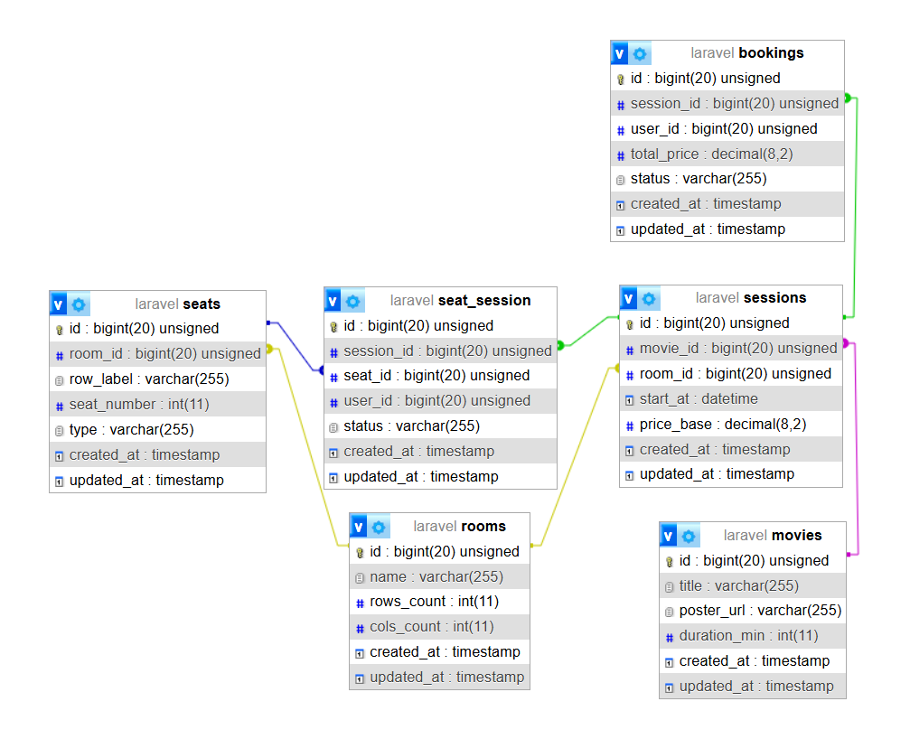
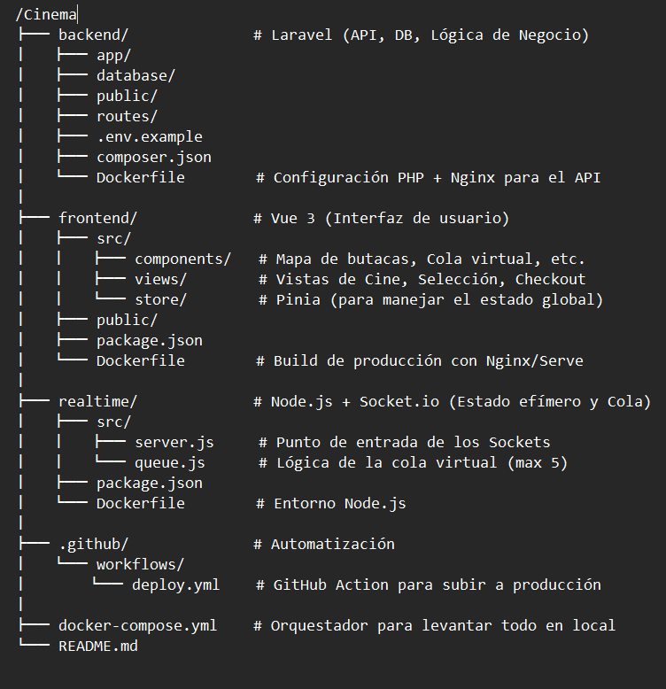
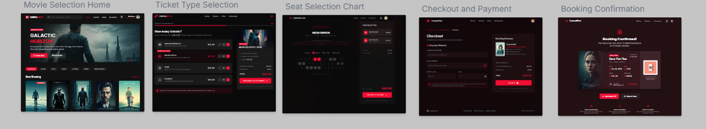
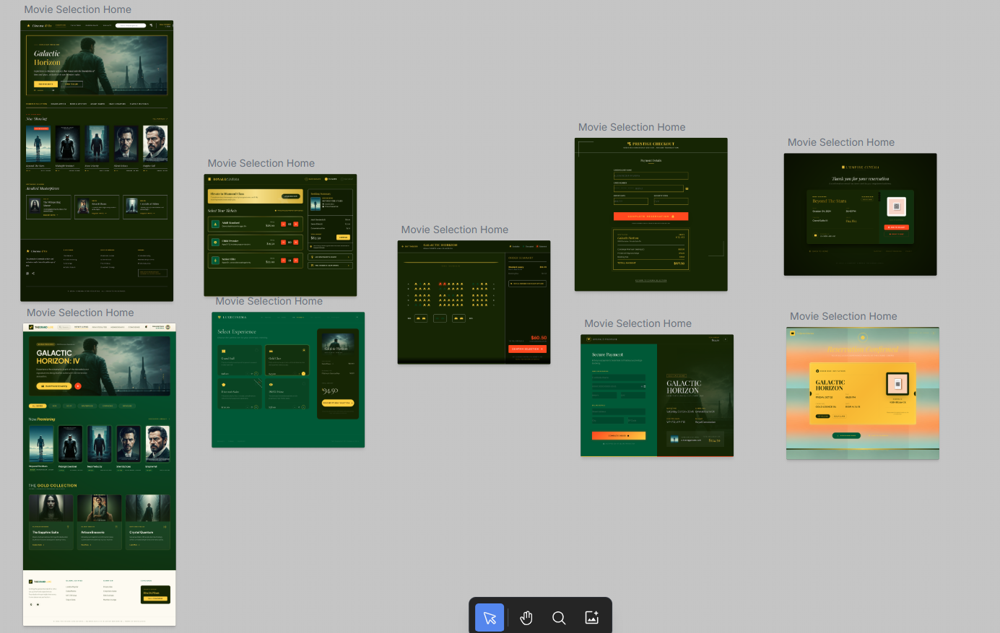

# 📋 Documentación del Proyecto

## 1. El Concepto y Objetivo

**Proyecto:** Sistema de gestión de reserva de butacas de cine en tiempo real.
**Alcance:** 3 semanas (3 Sprints completados).
**Tecnologías:** Nuxt 3 (Frontend), Laravel 12 (Backend/Persistencia) y Node.js + Socket.io + WebRTC (Tiempo real).
**Funcionalidad estrella:** Cola virtual de acceso (máximo 5 personas reservando a la vez) y gestión de asientos en tiempo real para evitar duplicidades.

## 2. Arquitectura de Estados (Butacas)

Un asiento pasa por tres estados:

- **Disponible:** Estado inicial. El asiento no aparece en la tabla `asientos` para esa sesión.
- **Bloqueado Temporal (5 min):** Gestionado por Node.js en memoria. Se activa cuando alguien hace clic en el mapa.
- **Vendido (Pagado):** Estado final persistido en MySQL a través de Laravel tras confirmar la compra.

## 3. Modelo de Datos (Laravel + MySQL)

### Tablas Implementadas

| Tabla       | Propósito                                                                             |
| ----------- | ------------------------------------------------------------------------------------- |
| `usuarios`  | Usuarios con rol `cliente` o `admin`                                                  |
| `peliculas` | Catálogo sincronizado desde API externa                                               |
| `sesiones`  | Sesiones programadas (película + sala + hora + precio)                                |
| `reservas`  | Cabecera de reserva (usuario/invitado, total pagado, nombre, email)                   |
| `asientos`  | Asientos ocupados: vinculados a una sesión y una reserva, con coordenada `asiento_id` |

> **Lógica de "Asiento por excepción"**: la tabla `asientos` solo contiene filas cuando un asiento está reservado. Si un asiento no aparece para una sesión dada, está disponible.

## 4. Capa Realtime (Node.js)

El servidor modular en `/realtime/src/` se encarga de:

- **La Cola:** Si hay > 5 usuarios activos en una sesión, los manda a `sala-espera.vue` con su posición visible.
- **El Bloqueo:** Notifica a todos los clientes cuando alguien selecciona un asiento (pasa a gris/bloqueado instantáneamente por WebSocket).
- **Desconexiones:** Si un usuario se desconecta, libera sus asientos y avanza la cola.
- **Estado HTTP:** Ruta `/admin/state` para consulta transparente desde el panel de administración.

### Módulos del Servidor Realtime

| Fichero                     | Responsabilidad                        |
| --------------------------- | -------------------------------------- |
| `src/server.js`             | Punto de entrada (Express + Socket.io) |
| `src/estado.js`             | Estado en memoria centralizado         |
| `src/rutas/admin.js`        | Ruta HTTP `/admin/state`               |
| `src/servicios/colas.js`    | Lógica de cola virtual                 |
| `src/servicios/asientos.js` | Control de bloqueos y expiración       |
| `src/sockets/eventos.js`    | Listeners de Socket.io                 |

## 5. Infraestructura y Git

- **Repositorio:** Monorepo con carpetas `/backend`, `/frontend` y `/realtime`.
- **Ramas:** `main` (Producción) y `dev` (Desarrollo).
- **Despliegue:** Docker Compose con 6 servicios (frontend, backend, realtime, db, adminer, mailpit).
- **CI/CD:** GitHub Actions para despliegue automático al hacer merge a `main`.

### Servicios Docker

| Servicio          | Puerto | Descripción              |
| ----------------- | ------ | ------------------------ |
| `cinema_frontend` | 3000   | Nuxt 3 SSR               |
| `cinema_backend`  | 8000   | Laravel API              |
| `cinema_realtime` | 3002   | Node.js + Socket.io      |
| `cinema_db`       | 3306   | MySQL 8.0                |
| `cinema_adminer`  | 8080   | GUI de base de datos     |
| `cinema_mailpit`  | 8025   | Servidor SMTP de pruebas |

## 6. Flujo de Usuario

1. **Home** (`/`) — Selección de película desde el catálogo sincronizado.
2. **Sesión** (`/sesion/[id]`) — Selección de horario y tipo de entrada (General, VIP, Accesibilidad).
3. **Cola Virtual** (`/sala-espera`) — Solo si hay más de 5 personas simultáneas.
4. **Mapa de Asientos** (`/sesion/[id]/asientos`) — Selección táctil/clic con feedback en tiempo real vía WebSocket.
5. **Checkout** (`/sesion/[id]/checkout`) — Resumen del carrito y formulario de pago con timer de 5 min.
6. **Confirmación** (`/reserva/[id]`) — Ticket digital con código QR.

## 7. Panel de Administración

- **Dashboard** (`/admin`) — Métricas generales: total de reservas, ingresos, películas más vendidas.
- **Informes** (`/admin/informes`) — Desglose por tipo de entrada, tasa de ocupación, evolución temporal de ventas (gráficos con Chart.js).

## 8. Tests (Cypress E2E)

| Suite               | Descripción                                              |
| ------------------- | -------------------------------------------------------- |
| `navigation.cy.js`  | Navegación básica por todas las secciones                |
| `book_ticket.cy.js` | Flujo completo de reserva de entrada                     |
| `admin_panel.cy.js` | Dashboard, informes y detalle de película en panel admin |

## Estado del Proyecto

✅ **Sprint 3 completado — En fase de verificación final**

| Sprint   | Estado        | Hitos                                                                               |
| -------- | ------------- | ----------------------------------------------------------------------------------- |
| Sprint 1 | ✅ Completado | Arquitectura base, Docker, DB, API películas y reservas                             |
| Sprint 2 | ✅ Completado | Mapa de asientos en tiempo real, flujo de compra completo, panel admin              |
| Sprint 3 | ✅ Completado | Refactoring modular realtime, tests Cypress, informes admin, correcciones de lógica |
